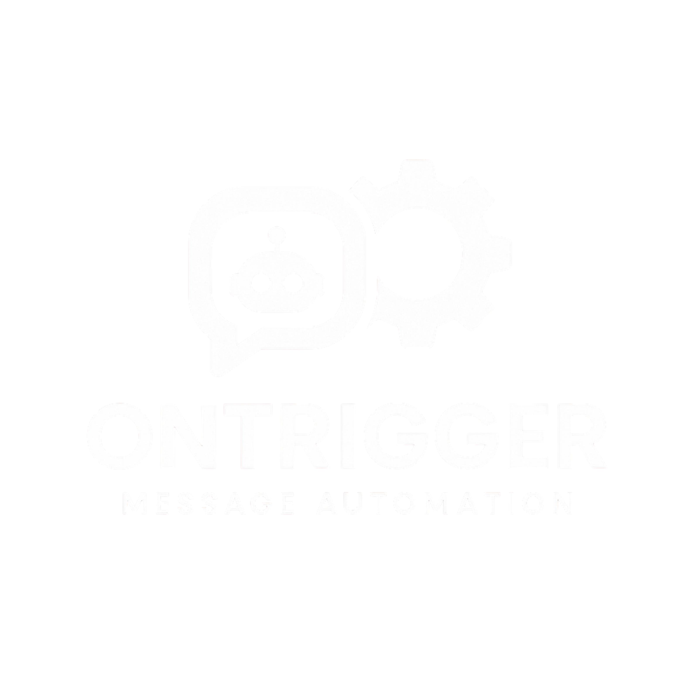

# OnTrigger

  

**OnTrigger** é uma aplicação desktop feita com **React** + **Electron** que automatiza o monitoramento de planilhas do Google e envia **mensagens automáticas no WhatsApp** com base em regras personalizadas. Um caso de uso comum é o envio de alertas para pessoas que estão devendo documentos, tudo de forma automatizada.

## ✨ Funcionalidades

- Integração com **Google Sheets** e **Google Drive**.
- Leitura automática de dados da planilha.
- Envio de mensagens no WhatsApp com base em regras.
- Interface desktop simples e leve.
- Configuração por variáveis de ambiente.

## ⚙️ Tecnologias

- [React](https://reactjs.org/)
- [Electron](https://www.electronjs.org/)
- [Google APIs (Sheets & Drive)](https://console.cloud.google.com/)
- Node.js

### 💡 Criado por @jopaul0